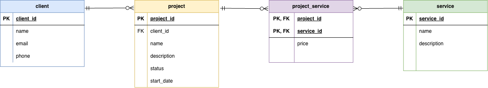

# PRO2003 - Work Requirement 1
PostgreSQL database design and implementation for Work Requirement 1.

## Domain

This database is designed for a small web and design studio. It is used to manage clients, their projects, and the services included in each project.

## Database Design

The database consists of four tables:

- `client` stores information about the studio's clients.
- `project` stores projects and connects each project to a client.
- `service` stores the services offered by the studio.
- `project_service` connects projects and services.

One client can have multiple projects, creating a one-to-many relationship between `client` and `project`.

A project can include multiple services, and the same service can be used in multiple projects. This many-to-many relationship is resolved through the `project_service` table.

The price is stored in `project_service` rather than `service`, because the price of a service may vary between projects. The combination of `project_id` and `service_id` is used as a composite primary key to prevent the same service from being added to the same project more than once.

## ER Diagram

The ER diagram shows the structure of the database and the relationships between the four tables. Crow's Foot notation is used to represent the one-to-many and many-to-many relationships.

## Setup and Testing

The database was created using PostgreSQL running in Docker and tested through DBeaver. The `schema.sql` script was executed successfully to verify that all tables and relationships were created correctly.